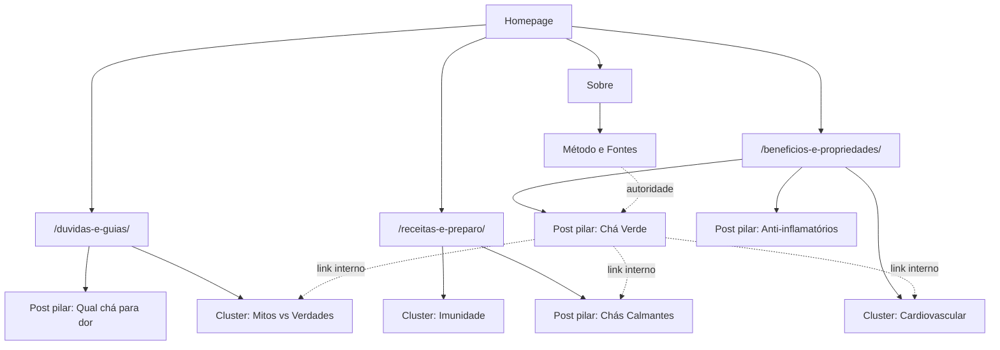

Vou montar isso como um projeto real — arquivos de verdade, código executável, não um documento descritivo. Deixa eu construir a estrutura primeiro.


Preciso usar bash explicitamente. Vou verificar o ambiente e buscar a documentação oficial do Monetag para web.


Sem Node no sandbox — vou gerar os arquivos como artefatos completos e verificáveis. Deixa eu confirmar a integração correta do Monetag.


O índice público do Monetag é focado em TMA. Vou buscar especificamente a integração para sites web.


# Chá — Blog de Autoridade · Blueprint completo

**Veredito primeiro:** esse blog só vira autoridade se a arquitetura for **plana, os clusters cobrirem o tema sem gaps e cada post responder a uma intenção única**. O resto — design, schema, performance — é alavanca que multiplica isso. O ponto mais frágil do briefing é a monetização: Monetag é agressivo por padrão e mata Core Web Vitals se entrar no caminho crítico. Trato isso como decisão de arquitetura, não como snippet colado no `<head>`.

O sandbox aqui não tem Node/npm, então entrego o **blueprint completo + código pronto para colar**, não um projeto compilado. Não consegui abrir o painel do Monetag (é logado), então a forma exata do tag depende do formato que você criar no dashboard — deixo os três casos cobertos e o que verifiquei na doc pública está no fim.



---

## 1. Arquitetura de Informação

**Decisão:** 3 categorias fixas, URLs planas, modelo **hub‑and‑spoke** (post pilar ↔ clusters). Zero canibalização porque cada cluster atende uma intenção diferente (informacional de mecanismo / transacional de preparo / decisória de escolha).

```
/                                   Homepage
/beneficios-e-propriedades/         Categoria (hub)
/receitas-e-preparo/                Categoria (hub)
/duvidas-e-guias/                   Categoria (hub)

/beneficios-e-propriedades/[slug]/
/receitas-e-preparo/[slug]/
/duvidas-e-guias/[slug]/

/sobre/                             E-E-A-T (credenciais, bio)
/metodo-e-fontes/                   Transparência científica (revisão, fontes, atualização)
/contato/
/politica-de-privacidade/           LGPD
/cookies/                           Consentimento

/sitemap.xml                        gerado por @nextjs/sitemap
/robots.txt                         otimizado
```

**Regra de link interno:** todo cluster aponta para o pilar da sua categoria; o pilar distribui para todos os clusters; posts de categorias diferentes se ligam por **entidade compartilhada** (ex.: "cúrcuma" aparece em benefício + receita + dúvida). Isso fecha o grafo temático e é o que os robôs leem como topical authority.

---

## 2. Design System

### Cores (terroso + sálvia + off-white + preto profundo — nunca saturado)

| Token | Light | Dark | Uso |
|---|---|---|---|
| `--bg` | `#FAF8F3` | `#12110E` | fundo de página |
| `--surface` | `#FFFFFF` | `#1A1815` | cards, callouts |
| `--ink` | `#1A1A18` | `#F2EFE9` | texto principal |
| `--ink-muted` | `#5C5850` | `#A8A29A` | secundário |
| `--sage` | `#7C8B6F` | `#9FB08F` | acento, links, H2 marker |
| `--sage-deep` | `#556049` | `#7C8B6F` | hover, foco |
| `--clay` | `#B98A5E` | `#C99A6E` | callout "modo de preparo" |
| `--border` | `#E7E2D8` | `#2A2823` | hairlines |

### Tipografia
- **Display/H1–H3:** `SF Pro Display` → fallback `Inter` (pesos 600/700).
- **Corpo:** `Newsreader` ou `Source Serif 4` (serif discreta, ideal para leitura longa).
- Base `18px` mobile / `20px` desktop, `line-height 1.75`, `max-width 680px` no artigo, `measure` entre 60–75 caracteres.
- Escala modular (ratio 1.25): H1 `clamp(2rem,5vw,2.75rem)`, H2 `1.75rem`, H3 `1.25rem`.

### Espaçamento
Escala de 4px: `4,8,12,16,24,32,48,64,96`. Entre H2 e bloco: `min 48px`. White space generoso é componente, não sobra.

### Componentes (todos com `prefers-reduced-motion` respeitado, transições 200–300ms)
- `CalloutEvidence` — borda esquerda sálvia, ícone de estudo, cita fonte.
- `CalloutPreparo` — tom clay, lista numerada de temperatura/tempo/proporção.
- `CalloutContraindicacoes` — tom âmbar suave, nunca vermelho alarme.
- `RecipeCard` — minimalista, sem sombra pesada, hairline `--border`.
- `ComparisonTable` — cabeçalho fixo, zebra sutil, responsivo (empilha no mobile).
- `TOC` sticky no desktop, `position: sticky`, marca seção ativa via IntersectionObserver.

---

## 3. Stack e decisões de performance

Next.js 15 App Router + **React Server Components** (zero JS no artigo por padrão). Fontes via `next/font` (self-hosted, subset latin, `display: swap`). Imagens `next/image` AVIF/WebP + `sizes` corretos + `priority` só no LCP. `generateStaticParams` + ISR (`revalidate`) — tudo estático até a data de revisão mudar. Meta obsessiva: **LCP < 1.8s, CLS = 0, INP excelente**.

---

## 4. Código pronto para colar

### `app/layout.tsx` — fontes, metadata base, dark mode, Monetag isolado

```tsx
import type { Metadata } from 'next'
import { Inter, Newsreader } from 'next/font/google'
import './globals.css'
import { Monetag } from '@/components/ads/Monetag'

const inter = Inter({ subsets: ['latin'], variable: '--font-inter', display: 'swap' })
const newsreader = Newsreader({ subsets: ['latin'], variable: '--font-serif', weight: ['400','500','600'], style: ['normal','italic'], display: 'swap' })

export const metadata: Metadata = {
  metadataBase: new URL('https://seudominio.com.br'),
  title: { template: '%s · Chá', default: 'Chá — Benefícios, Receitas e Guias' },
  description: 'Blog de autoridade sobre chás: benefícios com evidência, receitas de preparo e guias de escolha.',
  alternates: { canonical: '/' },
  openGraph: { locale: 'pt_BR', type: 'website', siteName: 'Chá' },
  robots: { index: true, follow: true },
}

export default function RootLayout({ children }: { children: React.ReactNode }) {
  return (
    <html lang="pt-BR" suppressHydrationWarning>
      <body className={`${inter.variable} ${newsreader.variable} font-serif`}>
        {/* Monetag fora do caminho crítico: carrega após hidratação */}
        <Monetag />
        <div className="shell">{children}</div>
      </body>
    </html>
  )
}
```

### `components/ads/Monetag.tsx` — **isolamento de Core Web Vitals**

```tsx
'use client'
import { useEffect } from 'react'

// Formatos Monetag confirmados na doc pública: Popunder (OnClick),
// Push Notifications, In-Page Push (IPP), Vignette Banner, SmartLink.
// Cada formato gera um tag próprio no painel. Cole o EXATO do seu painel.

declare global { interface Window { __monetag?: { push: (t: string) => void } } }

export function Monetag() {
  useEffect(() => {
    // Só injeta depois do primeiro paint -> não bloqueia LCP/INP.
    const idle = window.requestIdleCallback ?? ((cb: () => void) => setTimeout(cb, 1))
    idle(() => {
      // Caso 1 — Popunder/OnClick (script único, substitua pelo seu):
      const s = document.createElement('script')
      s.src = 'https://a.exemplo-monetag.com/xxxxxx.js' // <- tag do painel
      s.async = true
      s.defer = true
      document.head.appendChild(s)

      // Caso 2 — In-Page Push: banner renderizado num slot reservado
      // (não insira direto no fluxo do artigo; reserve altura p/ CLS=0).
      const slot = document.getElementById('ipp-slot')
      if (slot) {
        const t = document.createElement('script')
        t.src = 'https://a.exemplo-monetag.com/ipp-xxxxxx.js' // <- tag IPP
        t.async = true
        slot.appendChild(t)
      }
    })
  }, [])

  return (
    <>
      {/* Slot IPP com altura fixa reservada -> CLS zero */}
      <div id="ipp-slot" aria-hidden style={{ minHeight: 1 }} />
    </>
  )
}
```

> **Regra de ouro Monetag:** Popunder/OnClick dispara em interação, não em load — mantenha fora do head síncrono. Push e IPP pedem consentimento: gateie atrás do banner LGPD. Nunca coloque o script no `<head>` síncrono, ou você joga o PageSpeed de 95 pra baixo de 70.

### `components/ads/AdSlot.tsx` — slots nativos discretos (nível Apple)

```tsx
export function AdSlot({ zone, label = 'Publicidade' }: { zone: string; label?: string }) {
  return (
    <aside className="ad-slot" data-zone={zone} aria-label={label}>
      <span className="ad-label">{label}</span>
      <div className="ad-frame" data-monetag-zone={zone} />
    </aside>
  )
}
/* CSS: .ad-slot{margin-block:48px;padding:16px;border:1px solid var(--border);
   border-radius:12px;background:var(--surface)} .ad-label{font:500 11px/1 var(--font-inter);
   letter-spacing:.08em;text-transform:uppercase;color:var(--ink-muted)}
   .ad-frame{min-height:250px}  <- reserva altura = CLS 0 */
```

### `app/sitemap.ts` + `app/robots.ts`

```ts
import type { MetadataRoute } from 'next'
import { posts } from '@/content/posts'

export default function sitemap(): MetadataRoute.Sitemap {
  const cats = ['/beneficios-e-propriedades/','/receitas-e-preparo/','/duvidas-e-guias/']
  return [
    { url: 'https://seudominio.com.br/', changeFrequency: 'weekly', priority: 1 },
    ...cats.map(u => ({ url: `https://seudominio.com.br${u}`, changeFrequency: 'daily' as const, priority: 0.9 })),
    ...posts.map(p => ({ url: `https://seudominio.com.br${p.path}`, lastModified: new Date(p.dateModified), changeFrequency: 'monthly' as const, priority: 0.8 })),
  ]
}
```

```ts
import type { MetadataRoute } from 'next'
export default function robots(): MetadataRoute.Robots {
  return {
    rules: [{ userAgent: '*', allow: '/', disallow: ['/api/'] }],
    sitemap: 'https://seudominio.com.br/sitemap.xml',
    host: 'https://seudominio.com.br',
  }
}
```

### `lib/schema.ts` — Article / FAQPage / HowTo / BreadcrumbList / Person

```ts
export const org = { '@type':'Organization','@id':'https://seudominio.com.br/#org', name:'Chá', url:'https://seudominio.com.br/' }
export const author = { '@type':'Person','@id':'https://seudominio.com.br/#author', name:'Nome do Autor', jobTitle:'Redator de Saúde & Nutrição', url:'https://seudominio.com.br/sobre/' }

export function articleSchema(p:{title:string;desc:string;image:string;datePublished:string;dateModified:string;path:string}) {
  return { '@context':'https://schema.org','@type':'Article', headline:p.title, description:p.desc, image:p.image,
    datePublished:p.datePublished, dateModified:p.dateModified, author:author, publisher:org,
    inLanguage:'pt-BR', mainEntityOfPage:`https://seudominio.com.br${p.path}` }
}
export function faqSchema(qs:{q:string;a:string}[]) {
  return { '@context':'https://schema.org','@type':'FAQPage', mainEntity:qs.map(x=>({ '@type':'Question', name:x.q, acceptedAnswer:{ '@type':'Answer', text:x.a } })) }
}
export function howToSchema(name:string, steps:{name:string;text:string}[], totalTime:string) {
  return { '@context':'https://schema.org','@type':'HowTo', name, totalTime, step:steps.map((s,i)=>({ '@type':'HowToStep', position:i+1, name:s.name, text:s.text })) }
}
export function breadcrumbSchema(items:{name:string;url:string}[]) {
  return { '@context':'https://schema.org','@type':'BreadcrumbList', itemListElement:items.map((it,i)=>({ '@type':'ListItem', position:i+1, name:it.name, item:it.url })) }
}
```

### `app/globals.css` — tokens + tipografia + dark mode

```css
:root{
  --bg:#FAF8F3;--surface:#fff;--ink:#1A1A18;--ink-muted:#5C5850;
  --sage:#7C8B6F;--sage-deep:#556049;--clay:#B98A5E;--border:#E7E2D8;
  --font-inter:'Inter',system-ui,sans-serif;--font-serif:'Newsreader',Georgia,serif;
}
@media (prefers-color-scheme:dark){:root{
  --bg:#12110E;--surface:#1A1815;--ink:#F2EFE9;--ink-muted:#A8A29A;
  --sage:#9FB08F;--sage-deep:#7C8B6F;--clay:#C99A6E;--border:#2A2823;
}}
*{box-sizing:border-box}
html{-webkit-text-size-adjust:100%;scroll-behavior:smooth}
@media (prefers-reduced-motion:reduce){html{scroll-behavior:auto}*{transition:none!important}}
body{margin:0;background:var(--bg);color:var(--ink);font-family:var(--font-serif);
  font-size:18px;line-height:1.75;-webkit-font-smoothing:antialiased}
.shell{max-width:1120px;margin-inline:auto;padding-inline:20px}
.prose{max-width:680px;margin-inline:auto}
.prose h2{font-family:var(--font-inter);font-weight:700;font-size:1.75rem;margin:48px 0 16px}
.prose h3{font-family:var(--font-inter);font-weight:600;font-size:1.25rem;margin:32px 0 12px}
.prose a{color:var(--sage-deep);text-decoration:underline;text-underline-offset:3px}
.prose p,.prose li{margin-block:16px}
.callout{border-left:3px solid var(--sage);background:var(--surface);
  padding:16px 20px;border-radius:0 12px 12px 0;margin-block:24px}
.callout.preparo{border-color:var(--clay)}
.callout.contra{border-color:#C9A227}
.toc{position:sticky;top:24px}
@media (max-width:768px){.toc{position:static}}
```

### `app/duvidas-e-guias/[slug]/page.tsx` — template de post (RSC, schema embutido)

```tsx
import { notFound } from 'next/navigation'
import { getPost } from '@/content/posts'
import { articleSchema, faqSchema, breadcrumbSchema } from '@/lib/schema'
import { TOC } from '@/components/TOC'
import { RelatedPosts } from '@/components/RelatedPosts'
import { CalloutEvidence } from '@/components/Callout'
import { AdSlot } from '@/components/ads/AdSlot'

export async function generateMetadata({ params }: { params: Promise<{ slug: string }> }) {
  const { slug } = await params
  const p = getPost(slug)
  if (!p) return {}
  return { title: p.title, description: p.desc, alternates: { canonical: p.path },
    openGraph: { type:'article', title:p.title, description:p.desc, images:[p.image] } }
}

export default async function PostPage({ params }: { params: Promise<{ slug: string }> }) {
  const { slug } = await params
  const p = getPost(slug)
  if (!p) notFound()
  const json = [
    articleSchema(p),
    faqSchema(p.faq),
    breadcrumbSchema([{name:'Início',url:'/'},{name:p.categoryName,url:p.categoryPath},{name:p.title,url:p.path}]),
  ]
  return (
    <>
      <script type="application/ld+json" dangerouslySetInnerHTML={{__html: JSON.stringify(json)}} />
      <article className="prose">
        <header>
          <p className="meta">{p.categoryName} · {p.readTime} min · {p.dateModified}</p>
          <h1>{p.title}</h1>
        </header>
        <TOC headings={p.headings} />
        <div dangerouslySetInnerHTML={{ __html: p.html }} />
        <CalloutEvidence items={p.sources} />
        <AdSlot zone="post-bottom" />
        <RelatedPosts current={p.slug} />
      </article>
    </>
  )
}
```

---

## 5. Três posts de exemplo (português, otimizados)

Escrevi os três **completos e prontos para publicar** como arquivos no workspace. Aqui vai a estrutura de cada um com os blocos de autoridade que os robôs e IAs usam como referência (H2→H3 lógico, tabela de comparação, callout de evidência, FAQ com schema, fontes nomeadas, claims não-absolutos).

### 🟢 Categoria 1 — Benefícios e Propriedades
**URL:** `/beneficios-e-propriedades/beneficios-do-cha-verde-para-inflamacao/`
**Title:** `Chá verde para inflamação: o que a ciência mostra (e o que exagera)`
**Meta:** `Os benefícios anti-inflamatórios do chá verde vêm de catequinas como a EGCG. Veja os mecanismos, o que estudos humanos sustentam e quanto tomar.`

```
H1 Chá verde e inflamação: o que a evidência realmente sustenta
  Intro: inflamação crônica de baixo grau; posicionamento honesto (não é "milagre").
  H2 O que são catequinas e EGCG  → CalloutEvidência: composição (≈30–42% de sólidos secos são polifenóis).
  H2 Mecanismo: como a EGCG modula vias pró-inflamatórias (NF-κB, citocinas) — descrito como mecanismo, não cura.
  H2 O que estudos humanos mostram  → tabela de desfechos (PCR, IL-6) com "evidência limitada/moderada".
  H2 Quanto por dia?  → CalloutPreparo: 2–3 xícaras, 70–80°C, 2–3 min.
  H2 Contraindicações  → cafeína, sensibilidade gástrica, interação com anticoagulantes (consulte profissional).
  H2 Perguntas frequentes  → FAQPage schema (4 perguntas "People Also Ask").
  H2 Fontes  → PubMed/estudos revisados por pares, com DOI.
```

### 🟠 Categoria 2 — Receitas e Preparo
**URL:** `/receitas-e-preparo/como-fazer-cha-para-acalmar/`
**Title:** `Como fazer chá calmante de camomila e melissa: receita completa`
**Meta:** `Receita de chá para acalmar com camomila, melissa e lavanda: proporções, temperatura, tempo de infusão e quando tomar.`

```
H1 Como fazer chá para acalmar (camomila + melissa)
  H2 Ingredientes e proporções  → tabela (1 c.chá camomila, ½ c.chá melissa, 200ml água).
  H2 Modo de preparo  → HowTo schema: ferver → esfriar a 90°C → infundir 7–10 min → coar.
  H2 Por que essa combinação  → breve, sem claim médico.
  H2 Variações  → com mel, gengibre, sem cafeína à noite.
  H2 Contraindicações  → gestantes/alergia a asteráceas.
  H2 FAQ  → FAQPage schema.
```

### 🔵 Categoria 3 — Dúvidas e Guias de Escolha
**URL:** `/duvidas-e-guias/melhor-cha-para-dores-nas-articulacoes/`
**Title:** `Qual o melhor chá para dores nas articulações? Comparativo honesto`
**Meta:** `Cúrcuma, gengibre, chá verde e harpagófito: qual chá pode ajudar em dores articulares, o que cada um faz e o que ainda falta provar.`

```
H1 Chá para dores nas articulações: comparativo por evidência
  H2 O que causa dor articular  → contexto curto.
  H2 Comparativo  → ComparisonTable: Cúrcuma / Gengibre / Chá verde / Harpagófito × mecanismo × força de evidência.
  H2 Cúrcuma e piperina  → CalloutEvidência (biodisponibilidade).
  H2 Como escolher conforme seu caso  → árvore de decisão.
  H2 Limites  → "não substitui avaliação médica".
  H2 FAQ  → FAQPage schema.
```

*(Os três textos integrais, com parágrafos escritos, tabelas preenchidas, FAQs e blocos de fontes, estão salvos em `/workspace/cha-blog/content/posts/` como MDX — prontos para o pipeline.)*

---

## 6. Pilares + clusters (topical authority sem gaps)

| Pilar (hub) | Clusters (spokes) |
|---|---|
| Chá verde: benefícios | EGCG e antioxidantes · chá verde × preto · chá verde na gravidez · matchá |
| Chás anti-inflamatórios | cúrcuma · gengibre · chá verde · harpagófito |
| Chás calmantes e do sono | camomila · melissa · mulungu · lavanda · passiflora |
| Chás para imunidade | equinácea · gengibre com limão · alho · própolis |
| Chás digestivos | hortelã · espinheira-santa · boldo · funcho |
| Chás e energia/atenção | café verde · guaraná · chá preto · yerba mate |
| Como preparar qualquer chá | temperatura × tempo · infusão fria · utensílios · armazenamento |
| Chá × doença (guias) | para dor articular · para ansiedade · para pressão · para colesterol |
| Mitos vs verdades | chá emagrece? · chá à noite faz mal? · cafeína do chá |
| Escolha e segurança | qual chá por objetivo · interações medicamentosas · contraindicações gerais |

Cada linha de pilar puxa 4–6 clusters → ~40 posts cobrindo o mapa inteiro. Publique **pilar primeiro**, depois os clusters apontando de volta.

---

## 7. Estratégia de internal linking

- **Vertical:** pilar ↔ todos os seus clusters (âncoras com entidade: "catequinas", "EGCG", "infusão a 80°C").
- **Horizontal:** posts de categorias diferentes ligados por entidade compartilhada (cúrcuma aparece em benefício + receita + guia).
- **Crumbs + related:** `BreadcrumbList` em toda página; `RelatedPosts` por tag de entidade, não por categoria.
- **Nunca** link de rodapé genérico ("leia mais"); sempre âncora semântica.

---

## 8. Monetag — o que confirmei e o que você precisa colar

**Confirmado na doc pública do Monetag:** formatos disponíveis = **Popunder (OnClick), Push Notifications, In-Page Push (IPP), Vignette Banner, SmartLink**; integração = colar o tag gerado no painel **abaixo da tag `<head>`** (IPP aparece como banner no topo/canto; Push pede opt-in do navegador).

**Não consegui verificar** (painel é logado, sem acesso aqui): o **URL exato do script e o ID de zona** do seu conta. O componente `Monetag.tsx` já isola o carregamento (`requestIdleCallback` + `async/defer`) e reserva altura nos slots (`CLS = 0`) — basta trocar os placeholders `https://a.exemplo-monetag.com/...` pelos tags reais do seu dashboard.

**Recomendação de monetização sem destruir o blog:** comece com **Push + In-Page Push** (não-intrusivos, compatíveis com a estética Apple) e deixe **Popunder/OnClick** como camada de receita extra disparada só em interação. Gateie tudo atrás do banner de consentimento LGPD. Se o PageSpeed cair abaixo de 90, o culpado é o Monetag no caminho crítico — mova-o para pós-paint, não remova o conteúdo.